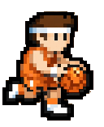
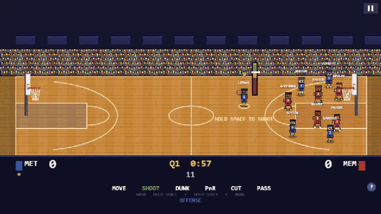
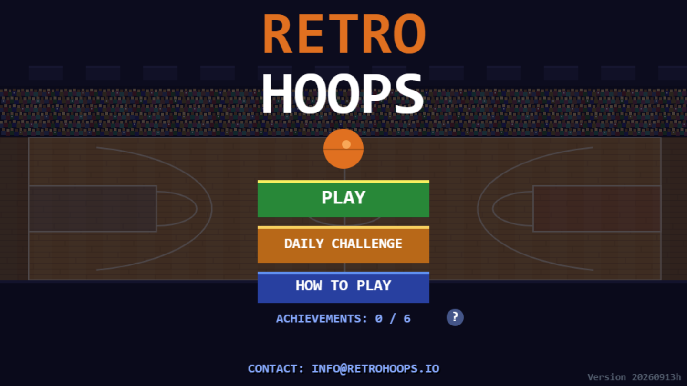
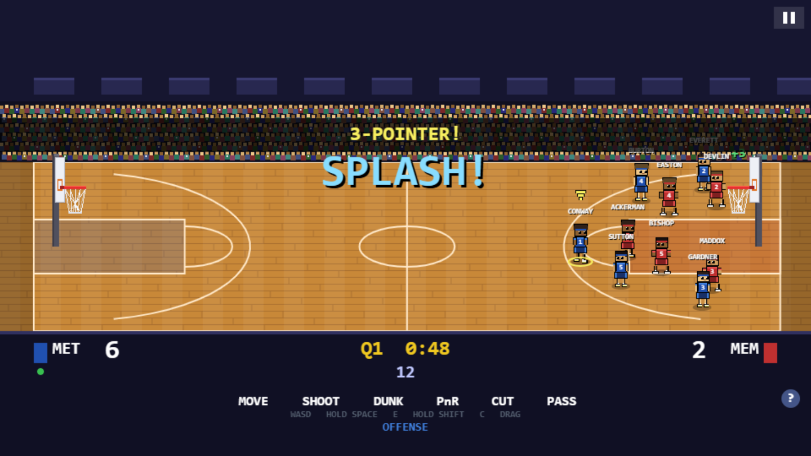
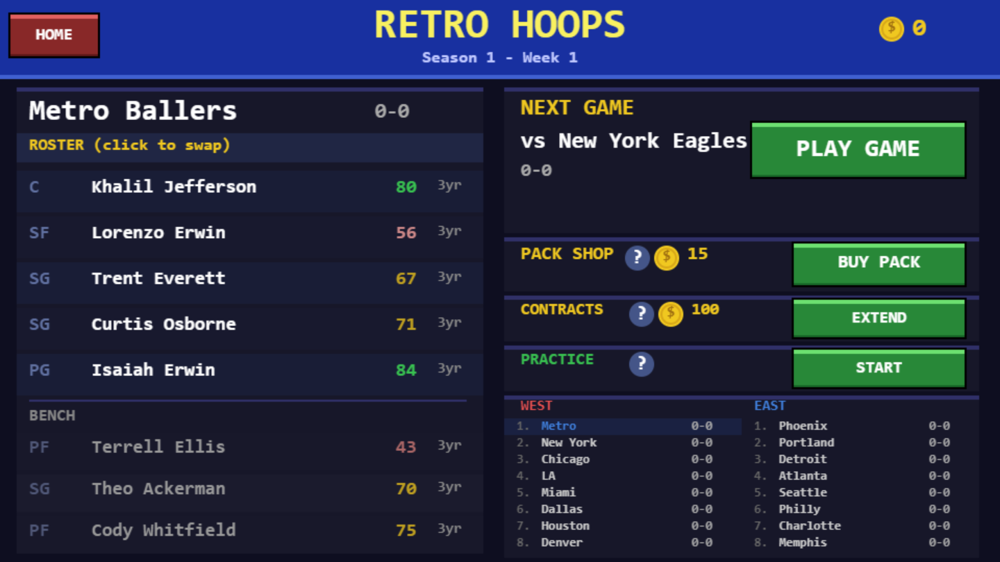
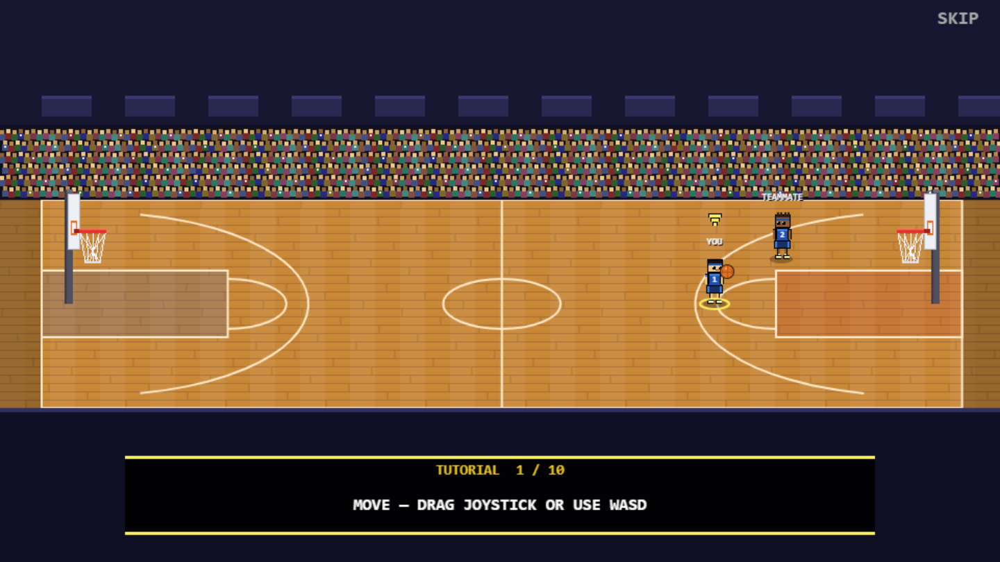
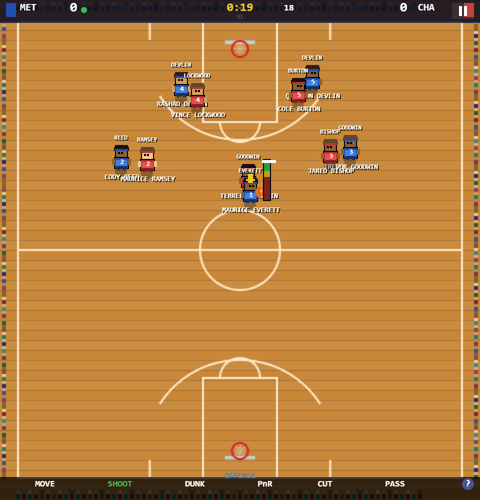
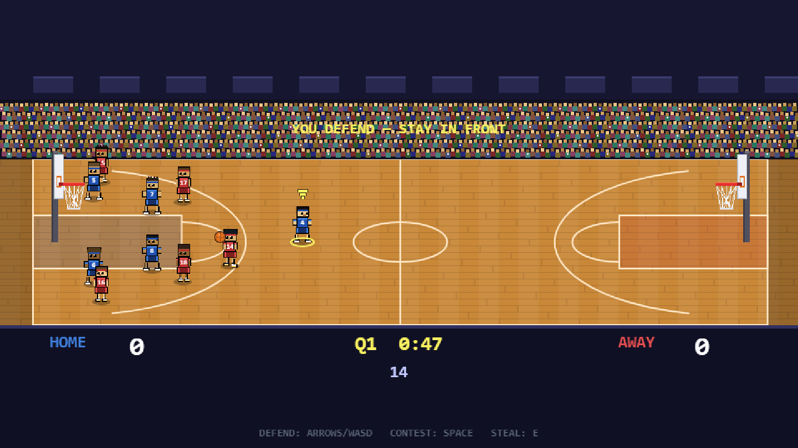

  

<h1 align="center">Retro Hoops</h1>

  <b>Pixel-art 5v5 basketball with a full franchise mode, playable free in the browser.</b> 
  Vanilla JavaScript + HTML5 Canvas · no engine, no build step, no dependencies  
  <a href="https://retrohoops.io"><b>▶ Play it at retrohoops.io</b></a> ·
  <a href="https://retrohoops2.netlify.app">Side-view prototype</a> ·
  <a href="#how-the-camera-changed">The A/B test</a> ·
  <a href="#engineering-highlights">Engineering highlights</a>

---

> **About this repo.** This is a portfolio showcase. The game's source is in a private
> repository; this page covers what I built and how. The game itself is live, so the
> best demo is to [play it](https://retrohoops.io). It works with a keyboard on desktop or
> on a phone held sideways.

## What it is

A side-view pixel basketball game in the spirit of *Hoop Land*, built from scratch on
a raw `<canvas>`:

- **Real 5v5 on both ends.** On offense you shoot with a timing meter, dunk, pass,
  run pick & rolls, call cuts and break ankles with crossovers. On defense you have to
  stay in front, time your contest jump to the shooter's release, and risk a reach-in
  foul when you swipe for a steal.
- **Franchise mode.** A 16-team league with seasons and standings, a playoff bracket, a
  rookie draft, a pack shop, contracts and coins, all auto-saved in the browser.
- **Around the game.** A daily challenge, achievements, practice mode, an on-court
  tutorial, halftime stats, a shareable result card, and touch controls for phones.
- **Feel.** Screen shake, hit-stop, slow motion on game-winners, commentary popups
  (*SPLASH!*, *POSTERIZED!*), and every sound synthesized live with the Web Audio API.

| | |
|---|---|
|  |  |
|  |  |

## How the camera changed

The most interesting decision in this project was changing the camera, and I treated it
as an experiment rather than a gut call.

| v1: top-down (Mar–Jul 2026) | v2: side-view prototype (Jul 2026) |
|---|---|
|  |  |
| Shipped with the full franchise mode, mobile controls, analytics and a share card. Gameplay read flat from directly above. | Built as a separate, time-boxed **camera A/B test**: one exhibition match, desktop only, deployed to its own site so it couldn't touch the live game. |

1. **Hypothesis.** A side or semi-side camera, like *Hoop Land*, makes the game more
   engaging than top-down. The pixel-art style stays because it is the brand.
2. **Scoped prototype.** Time-boxed to about two weeks and roughly 1,300 lines, written to a
   spec with locked projection constants and an explicit "do not build" list. Touch
   controls were left out on purpose: half-finished touch support would have mixed up
   "do I like this camera?" with "are these controls any good?"
3. **Success criteria written down first.** Playtesters had to prefer it to v1, or it had
   to clearly read better.
4. **Result.** The side view won. In September 2026 I ported **every** v1 system onto the
   new engine (franchise, draft, playoffs, tutorial, touch controls, analytics) without
   breaking existing save files, and shipped it as the live game at retrohoops.io.

## Engineering highlights

**A 3D court on a 2D canvas.** The world is modeled in feet: court length, court depth
and height. One projection, `sx = X0 + wx·XS`, `sy = HORIZON + wz·ZSLOPE − wy·YS`, maps it
to pixels. Sprites are never scaled by depth, to keep the pixels pure. Depth comes from
vertical offset, draw order and floor shadows. The ball gets a shadow too, so a lob
(height) never looks like a pass to a deeper teammate.

**Fixing the rendering traps of a side view:**
- A stable painter's-algorithm sort key `(depth, entityIndex)` stops sprites flickering
  when two players stand at the same depth.
- The rim and net are drawn in two halves, back before the ball and front after it, so
  swishes and dunks look right.
- A held ball is drawn as part of its holder's sprite rather than sorted on its own.

**Gameplay rules that make the payoff visible.** Every ball interaction is gated on
height: a grounded defender can't steal a 12-foot lob. A perfectly timed contest produces
a visible block with hit-stop and a sound, never an invisible probability nudge. The
controlled defender only switches when a pass completes, so control doesn't flip back and
forth mid-possession.

**Ratings drive everything.** A player's overall rating feeds run speed, dunk range,
shot-make odds (meter zone × shooting stat × contest × three-point penalty), AI shot
selection and steal odds. That's why the franchise mode matters on the court.

**Cheap but convincing physics.** Each shot's outcome is decided at release from meter
timing and contest state. One of three canned trajectories then plays: swish, rattle-in
or rim-out with a random bounce. To the player it's indistinguishable from simulated rim
physics, at about a quarter of the build cost.

**Designed first-minute experience.** There's no tip-off: you start with the ball. Hints
appear in context ("HOLD SPACE TO SHOOT", "YOU DEFEND, STAY IN FRONT"), and the tuning
target is a first made basket within about 15 seconds of loading the page.

**Zero-dependency engineering:**
- The whole game is about 2,800 lines in one vanilla JS module, running on a fixed 60 Hz
  timestep loop.
- All sound is synthesized live (swish, rim clank, whistle, crowd roar, shot-clock beeps),
  and it waits for the first keypress or click so browsers don't block it.
- It installs as a PWA, autosaves to `localStorage` and uses privacy-friendly analytics
  for the growth funnel.

**Tested and automated:**
- A headless smoke test stubs the DOM, plays a full four-quarter game with random input,
  then walks the whole franchise loop (game → bookkeeping → pack shop → practice →
  playoffs → draft → tutorial → daily challenge). It asserts that nothing throws and
  nothing deadlocks.
- Puppeteer + ffmpeg scripts generate the store screenshots, cover art and gameplay
  trailers.

## Tech

JavaScript (ES2020, no framework) · HTML5 Canvas 2D · Web Audio API · PWA manifest ·
`localStorage` saves · Netlify static hosting · Node headless smoke tests · Puppeteer +
ffmpeg asset pipeline · Umami / Plausible analytics

**Timeline:** started March 2026; v1 live in spring 2026; side-view prototype in July
2026; side view shipped as the live game in September 2026. 75+ commits.

---

Built by <a href="https://github.com/tejas808090">@tejas808090</a> · source available on request for interviews · <a href="https://retrohoops.io">retrohoops.io</a>

